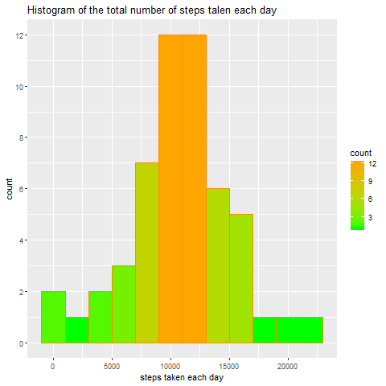
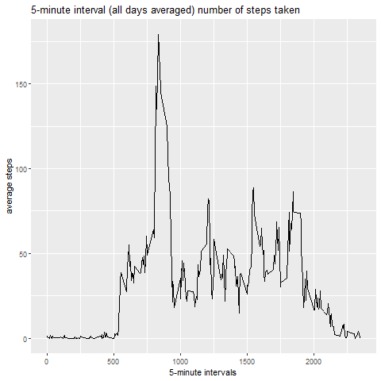
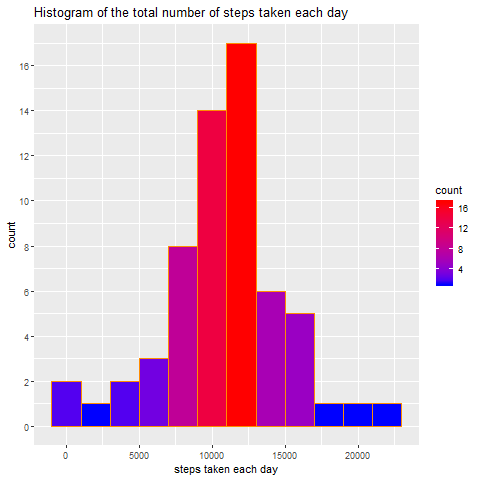
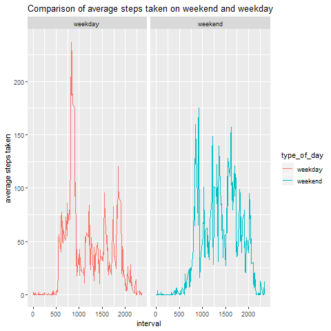

*Reproducible Research*
*Peer Graded Assignment: Course Project 1*

## Introduction

This assignment makes use of data from a personal activity monitoring device. This device collects data at 5 minute intervals through out the day. The data consists of two months of data from an anonymous individual collected during the months of October and November, 2012 and include the number of steps taken in 5 minute intervals each day.


## Loading Data

```r
library(dplyr)
```

```
## 
## Attaching package: 'dplyr'
```

```
## The following objects are masked from 'package:stats':
## 
##     filter, lag
```

```
## The following objects are masked from 'package:base':
## 
##     intersect, setdiff, setequal, union
```

```r
library(ggplot2)

setwd("C:/Users/asus/Desktop/Reproducible Research")

activity_with_na<-read.csv("activity.csv")

str(activity_with_na)
```

```
## 'data.frame':	17568 obs. of  3 variables:
##  $ steps   : int  NA NA NA NA NA NA NA NA NA NA ...
##  $ date    : Factor w/ 61 levels "2012-10-01","2012-10-02",..: 1 1 1 1 1 1 1 1 1 1 ...
##  $ interval: int  0 5 10 15 20 25 30 35 40 45 ...
```

## What is the mean total number of steps taken per day
*For this part of the assignment, you can ignore the missing values in the dataset.*

###1-Calculate the total number of steps taken per day


```r
steps<-activity_with_na%>%
  filter(!is.na(steps))%>%
  group_by(date)%>%
  summarize(daily_steps=sum(steps))

steps
```

```
## # A tibble: 53 x 2
##    date       daily_steps
##    <fct>            <int>
##  1 2012-10-02         126
##  2 2012-10-03       11352
##  3 2012-10-04       12116
##  4 2012-10-05       13294
##  5 2012-10-06       15420
##  6 2012-10-07       11015
##  7 2012-10-09       12811
##  8 2012-10-10        9900
##  9 2012-10-11       10304
## 10 2012-10-12       17382
## # ... with 43 more rows
```


###2-If you do not understand the difference between a histogram and a barplot, research the difference between them. Make a histogram of the total number of steps taken each day


```r
ggplot(steps,aes(daily_steps,fill=..count..))+geom_histogram(binwidth = 2000,col="dark orange")+
  scale_y_continuous(breaks = seq(0,13,by=2))+labs(x="steps taken each day",
                                                   title="Histogram of the total number of steps talen each day")+ scale_fill_gradient("count",low="green",high = "orange")
```

<!-- -->


###3-Calculate and report the mean and median of the total number of steps taken per day


```r
mean(steps$daily_steps,na.rm=TRUE)
```

```
## [1] 10766.19
```

```r
median(steps$daily_steps,na.rm=TRUE)
```

```
## [1] 10765
```

##What is the average daily activity pattern?

###1-Make a time series plot (i.e.type = "l") of the 5-minute interval (x-axis) and the average number of steps taken, averaged across all days (y-axis)


```r
activity<-activity_with_na
activity[is.na(activity_with_na)]<-0

steps_interval<-activity%>%
  group_by(interval)%>%
  summarize(steps_interval=mean(steps))

ggplot(steps_interval,aes(x=interval,y=steps_interval))+geom_line()+
  labs(title="5-minute interval (all days averaged) number of steps taken",x="5-minute intervals",y="average steps")
```

<!-- -->

###2-Which 5-minute interval, on average across all the days in the dataset, contains the maximum number of steps?


```r
steps_interval_mean<-activity_with_na%>%
  filter(!is.na(steps))%>%
  group_by(interval)%>%
  summarize(average_step=mean(steps))


steps_interval_mean[which.max(steps_interval_mean$average_step),]
```

```
## # A tibble: 1 x 2
##   interval average_step
##      <int>        <dbl>
## 1      835         206.
```

##Imputing missing values

###1-Calculate and report the total number of missing values in the dataset


```r
sum_of_na<-activity_with_na%>%
  filter(is.na(steps))%>%count(steps)

sum_of_na
```

```
## # A tibble: 1 x 2
##   steps     n
##   <int> <int>
## 1    NA  2304
```

###2-Devise a strategy for filling in all of the missing values in the dataset. The strategy does not need to be sophisticated. For example, you could use the mean/median for that day, or the mean for that 5-minute interval, etc.

The strategy that is going to be used is replacing the missing values in the data set with the mean of 5-minute interval of the day belonging to that day of the week (monday, tuesday,wednesday,thursday,friday,saturday or sunday)

If the mising value is in the interval of 1620 (16:20) and on monday,the value that is going to be imputed is the mean of all 1620 intervals on mondays.

###3-Create a new dataset that is equal to the original dataset but with the missing data filled in.


```r
Sys.setlocale("LC_TIME","English")
```

```
## [1] "English_United States.1252"
```

```r
day_steps_with_na<-activity_with_na%>%mutate(day_of_week=weekdays(as.Date(date)))%>%
  mutate(type_of_day=ifelse(day_of_week=="Saturday"|day_of_week=="Sunday","weekend","weekday"))

day_steps_filled<-day_steps_with_na%>%
  group_by(day_of_week,interval)%>%
  mutate(steps=replace(steps,is.na(steps),mean(steps,na.rm=TRUE)))
```


```r
day_steps<-day_steps_filled%>%
  group_by(date)%>%
  summarize(daily_steps=sum(steps))

day_steps
```

```
## # A tibble: 61 x 2
##    date       daily_steps
##    <fct>            <dbl>
##  1 2012-10-01       9975.
##  2 2012-10-02        126 
##  3 2012-10-03      11352 
##  4 2012-10-04      12116 
##  5 2012-10-05      13294 
##  6 2012-10-06      15420 
##  7 2012-10-07      11015 
##  8 2012-10-08       9975.
##  9 2012-10-09      12811 
## 10 2012-10-10       9900 
## # ... with 51 more rows
```


###4-Make a histogram of the total number of steps taken each day and Calculate and report the mean and median total number of steps taken per day. Do these values differ from the estimates from the first part of the assignment? What is the impact of imputing missing data on the estimates of the total daily number of steps?

The histogram of the total number of steps taken each day has changed slightly.It was more symmetric but the second histogram became slightly *left skewed* since the median has increased more than the mean. In the first histogram, missing values are ignored. The reason for increase in the median and mean may have been that the imputed missing values are mostly weekdays and daily average steps taken on weekdays are higher than the daily average steps on weekends.


```r
ggplot(day_steps,aes(daily_steps,fill=..count..))+geom_histogram(binwidth=2000,col="dark orange")+
  scale_y_continuous(breaks=seq(0,20,by=2))+
  labs(x="steps taken each day",title="Histogram of the total number of steps taken each day")+
  scale_fill_gradient("count",low="blue",high="red")
```

<!-- -->

```r
mean(day_steps$daily_steps)
```

```
## [1] 10821.21
```

```r
median(day_steps$daily_steps)
```

```
## [1] 11015
```

##Are there differences in activity patterns between weekdays and weekends?

###1-Create a new factor variable in the dataset with two levels – “weekday” and “weekend” indicating whether a given date is a weekday or weekend day.

This factor was created in question 2 in order to fill missing values by the mean pattern in day of the week and 5-minute intervals.

###2-Make a panel plot containing a time series plot of the 5-minute interval (x-axis) and the average number of steps taken,averaged across all weekday days or weekend days (y-axis).
*See the README file in the GitHub repository to see an example of what this plot should look like using simulated data.*


```r
day_steps_interval<-day_steps_filled%>%
  group_by(interval,type_of_day)%>%
  summarize(steps_interval=mean(steps))

ggplot(day_steps_interval,aes(x=interval,y=steps_interval))+geom_line(aes(color=type_of_day))+
  facet_grid(.~type_of_day)+
  labs(title="Comparison of average steps taken on weekend and weekday",y="average steps taken")
```

<!-- -->

**It can be seen that on weekdays, average steps increase in the morning and in the middle of the day average number of steps decrease. In the evening average number of steps increase.**

**On weekends, throughout of the day (except from sleep times), the number of steps taken does not change dramatically.**

